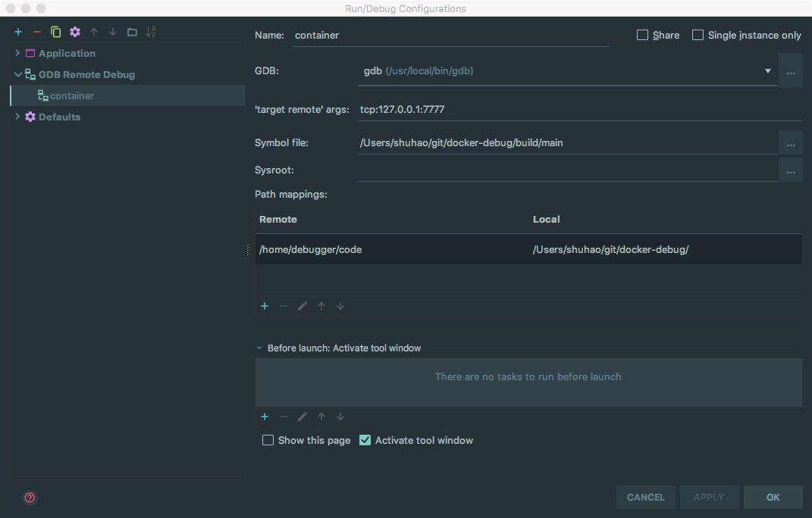

# Debugging C++ in a Docker Container with CLion

> Note: source code is modified from [Cornell CS 5450 course material](
https://pages.github.coecis.cornell.edu/cs5450/website/assignments/p1/docker.html).

This repository provides a minimal C++ project setup and the Dockerfile that
allows developers to debug code in a Docker container using JetBrain Clion IDE.

Debugging in a container has many benefits, especially if you are developing
Linux applications on OS X.

+ It allows a consistent environment between development and deployment;
+ The developers are free from installing dependencies on their development
machine. Some packages cannot be easily installed on OS X.
+ The container can be launched on your development machine, or on a remote
server.

## Introduction

All application code, as well as its dependencies, will be installed, compiled,
and ran within tht container. Then, we launch a `gdbserver` to allow remote
debugging outside of the container. Clion supports remote GDB debugging sessions
since [2016.2](https://blog.jetbrains.com/clion/2016/07/clion-2016-2-eap-remote-gdb-debug/).

The container has a long running ssh server process, such that the container can
be placed on a remote host. According to [this issue](https://youtrack.jetbrains.com/issue/CPP-744),
CLion may add automation support for remote projects/toolchains in a future
release. It may requires an ssh session to automate the process of launching
gdbservers.

> The container exposes 2 ports. 7777 is for `gdbserver` connection. 22 for the
ssh server. To avoid trouble when the container is launched on the development
machine, the container 22 port is mapped to host 7776 port. This can be changed
to any arbitrary number in `docker-compose.yml`.

## Prerequisites

On your development machine, you must have a latest version of CLion installed,
together with a `gdb` client built for x86-64 Linux targets. On a Mac, this can
be done with Homebrew:

```bash
brew install gdb --with-all-targets
```

On the host machine of your container (which can be the development machine),
the latest Docker CE installation would be sufficient.

## Usage

To debug the example, follow the following steps.

0. Import the project into CLion using the provided `CMakeLists.txt`.
0. Build the container.
    ```bash
    docker build -t liuempire/docker-clion-dev .
    ```
0. Launch the container with `docker-compose`.
    ```bash
    docker-compose up -d
    ```
0. Access the code inside the container. If you are running the container on the
same machine, you may run `docker exec` command. Otherwise, `ssh` into the
container with `ssh -p 7776 debugger@[ip-address]`. The password is `pwd`.
0. Modify the code inside the container. Note the code is not copied into the
container by default. Instead, in `docker-compose.yml`, we attach the project
root directory to the container as a volume mounted to `/home/debugger/code`.
That means any modifications to the code made on your development machine will
directly affect the code inside the container.
0. Build the project and launch `gdbserver` inside the container, by running
    ```bash
    ./start-gdb.sh
    ```
0. On your development machine, setup a GDB remote debugging session in CLion.
Here is a sample configuration. 
0. Add breakpoints in Clion. Happy debugging!

Note each time when you wish to restart the debugging session, you have to
*manually* re-run the `start-gdb.sh` script. This might be optimized with a
future CLion release, according to
[this link](https://youtrack.jetbrains.com/issue/CPP-744).

To stop the container, run `docker-compose down`.

## Customization

+ Add dependency installation scripts to `Dockerfile`.
+ Replace `CMakeLists.txt` with your customized project `CMakeLists.txt`. Make
sure you include `-g` flag in `CMAKE_CXX_FLAGS`, or configure it in the debug
mode.
+ Change the name of your application binary in `start-gdb.sh`, or provide the
new name as a parameter of running this script.
